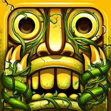

# Temple Run Game

## Mijn game:
-Wat hoort en ziet de speler: De speler ziet een lange brug die honderden meters hoog is en ziet de geruineerde stukken van de brug en stukken van de tempel. De speler hoort het geluid van de wind en het geluid van de voetstappen van de speler. De speler hoort ook het geluid van de vijanden die achter hem aan zitten.

-Wat verandert er in score/timer/progressie: De speler krijgt punten voor elke seconde dat hij overleeft hoeveel seconde hij overleeft is de eindscore die de speler krijgt.

-Wat beweegt of animeert: De speler beweegt automatisch naar voren en de speler kan naar links of rechts bewegen om obstakels te ontwijken. De vijanden bewegen ook automatisch achter de speler aan.

-Wat maakt de actie satisfying: Het ontwijken van obstakels en het overleven van de vijanden geeft de speler een gevoel van voldoening en spanning. Het zien van de score stijgen naarmate de speler langer overleeft, geeft ook een gevoel van prestatie.

## Mijn core mechanic:
De core machanic van mijn game is het swipen op je scherm of het gebruik van wasd om naar links, rechts, omhoog of omlaag te bewegen om obstakles te ontwijken die in de weg staan en de vijanden die achter je aan zitten te ontwijken.